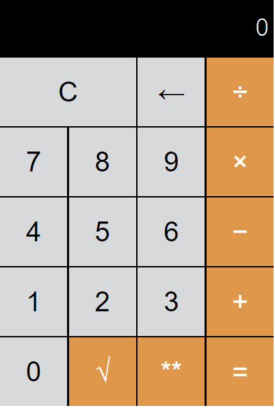

<h2>Simple calculator project</h2>
<h3>base made during frontendmasters course, but I develop it further. Made with HTML, CSS and JavaScript.</h3>

latest update: added working power button and square root.

Calculator works as it should. Actions that You can do:
math operations: add (+), subtract (-), multiply (×), divide (÷), raise to the power (**), take the square root (√) and other: clear (C), undo last typed digit (←).
The root button is just a placeholder for now.

Calculator can do operations on floats, but for now can't normally type float numbers. example:
9 / 2 == 4.5
4.5 + 5 == 5
can't type somthing like 4.5, but You can create it :)

TO DO:
1. add option to create floats,
2. change the screen settings to see whole mathematical operation,
3. add more math actions (factorial, percentage, etc)

